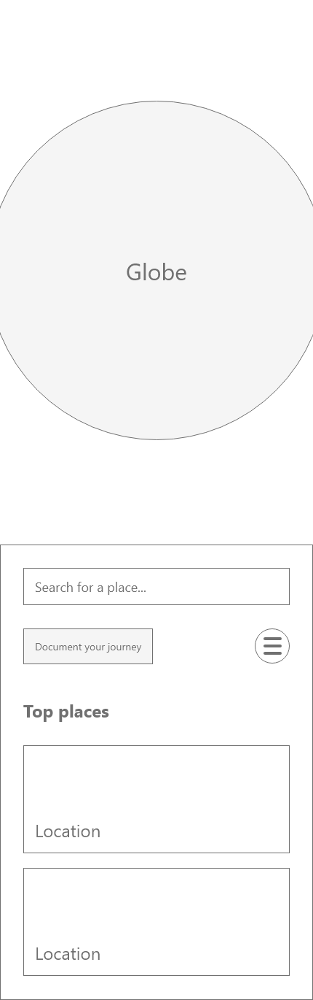
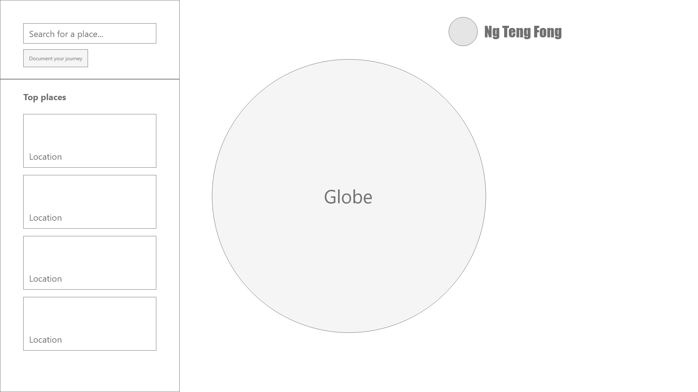
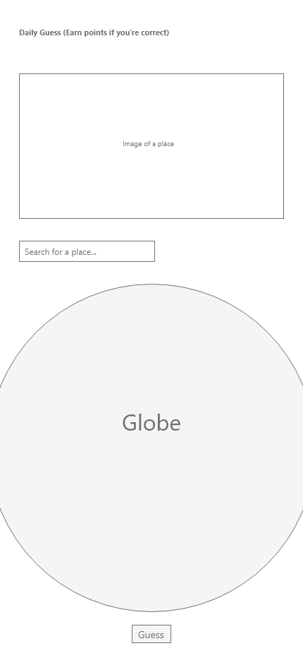
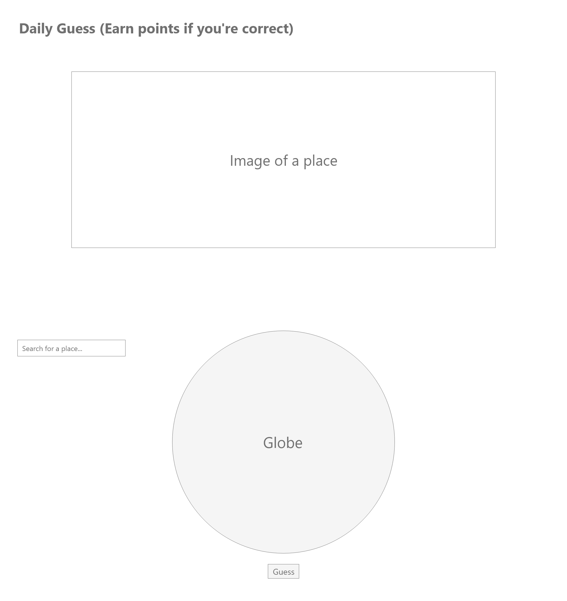
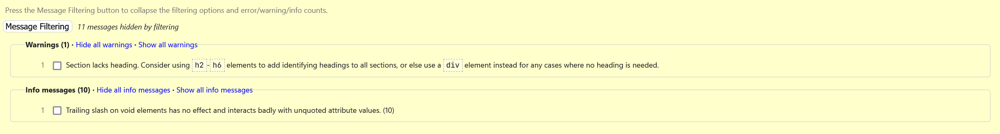
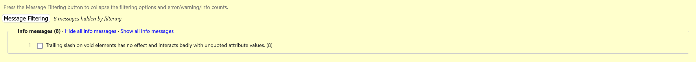
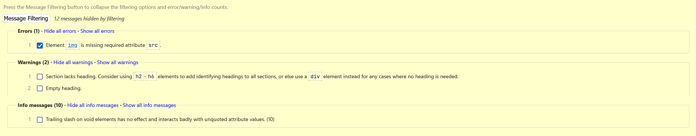
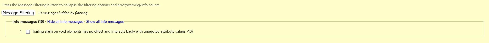
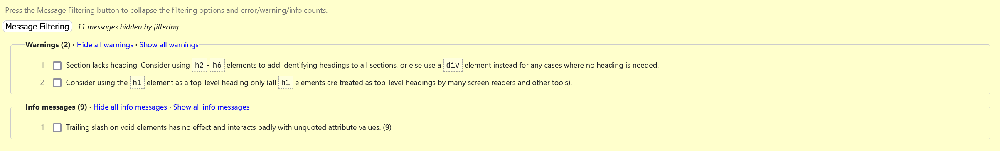

# Travel Buddy

Welcome to the repository for Travel Buddy, a short and interactive gamified experience that tracks the places you've been to! This project was created for a school module.

## About the project

Travel Buddy was created to explore front-end development further and tie in our concepts of [application programming interfaces](https://www.britannica.com/technology/API) that we've learnt in the module. We came up with the idea of a travel tracker as we felt that this idea encapsulated what we've learnt well.

The following is lifted from the assignment brief, stating what is expected of the project:

> 1. Create an interactive web application for the proposed idea.
> 2. Design, develop and implement an interactive front-end web application using HTML, CSS, JavaScript, and jQuery.
> 3. Implement front-end interactivity, using core JavaScript, JavaScript libraries and/or Application Programming Interfaces (APIs).
> 4. Apply source code management practices.
> 5. Utilize appropriate APIs or external APIs to interface with the application.
> 6. Utilize suitable Lottie animations.
> 7. Design a front-end web application based on sound design principles and accessibility.
> 8. Document proper testing plans made.
> 9. Demonstrate and document the development process through version control.
> 10. Deploy an interactive front-end web application to GitHub
> 11. Take on roles in web development (e.g API developer, front-end developer).

This project is written with web languages (i.e., HTML, CSS, and vanilla JavaScript); [index.html](https://github.com/ZeroTzu/ID_FinalAssignment/blob/main/index.html) is the main entry point.

The three of us wore different hats throughout the duration of the project, and no one person was static in the role taken. A rough overview of the roles we've done include:

- the UI/UX;
- the front-end;
- styling;
- the back-end (particularly, but not exclusively, using the Firebase SDK); and
- bug-fixing and fire-fighting.

We didn't assign each person to a particular page to work on, but rather had each person help out wherever help is needed. We therefore cannot attribute each page to be done by one person only.

## Features

### User stories

We started to think about what a travel tracker would have. We formulated the following user statements to help the features we would develop for our solution:

- As a user, I want to be able to contribute to others' experiences by sharing more about the trips and experiences I've made.
- As a user, I want to learn more about the experiences others have shared and particularly see the places that they have gone to.
- As a user, I want to be rewarded for sharing more about my experiences and interacting with the platform.

### Implemented features

We explored each user statement to help guide and structure our thinking. Eventually, we settled on having the following features that Travel Buddy currently has implemented:

- A sharing feature where a user can add photos and descriptions of the places they have gone to.
- A community-like feature where users can see the pictures that other users have shared.
- A dedicated authentication system. With this, users will be able to sign in to their accounts or create one. Internally, we can associate user accounts with pictures shared and perform identification if needed.
- An interactive and searchable globe. With this, users will be able to explore, recall, and look for places around the world.
- A gamified points system. With this, users can be encouraged to spend more time and interact more with the platform and be rewarded in terms of points.
- Mobile responsiveness. With this, users will be able to quickly create a post from wherever they are with ease.
- A guessing/trivia mini-game. With this, users stand the chance to earn points while being able to view the photos that other users have taken.

The following includes early rough wireframes that we have done. The wireframes were not extensive, and only had a few pages.

- Home (now `index.html`)
  | Mobile | Desktop |
  |:-:|:-:|
  |  | 

- Trivia (now `trivia.html`)
  | Mobile | Desktop |
  |:-:|:-:|
  |  | 

### Future features

We had several features that we'd like to implement but couldn't because of time constraints. These features include:

- A profile page that enables users to follow each other.
- An extensive community feature where users can like and comment on each other's posts.
- Conversion to airline mileage points. Since this project is in a fictitious context, we pitch the idea that points can eventually be used to be converted into airline mileage points. This adds further incentive for participation as users can earn their way to flights with the platform.

## Technologies

For this project, we've spent some time using multiple libraries and APIs to either add new functionality to our project or to make it easier for us to perform certain things. Here's a list of libraries and APIs we've used throughout the assignment:

|     Library/Tool/API     | Version number |          Link to homepage           | Description of use                                                                                                               |
| :----------------------: | :------------: | :---------------------------------: | :------------------------------------------------------------------------------------------------------------------------------- |
|       Mapbox GL JS       |     2.12.0     |   [Link](https://www.mapbox.com)    | Maps (static and interactive), geographic place lookups                                                                          |
| RestDB (no longer using) |                |      [Link](https://restdb.io)      | Back-end NoSQL database storage                                                                                                  |
|        Bootstrap         |      5.3       |  [Link](https://getbootstrap.com)   | CSS framework (consistent and simplified stylings)                                                                               |
|          jQuery          |     3.6.0+     |     [Link](https://jquery.com)      | JavaScript framework (simplifies DOM traversal and manipulation                                                                  |
|         Firebase         |     9.17.1     | [Link](https://firebase.google.com) | Back-end functionalities (Cloud Firestore for NoSQL database; Authentication for user identification; Storage for image storage) |
|         Polypane         |     13.0.1     |    [Link](https://polypane.app/)    | Responsive design testing across different screen sizes                                                                          |
|         Prettier         |       -        |    [Link](https://prettier.io/)     | Opinionated and automated code formatting                                                                                        |
|       LottieFiles        |       -        |   [Link](https://lottiefiles.com)   | Free animated Lottie files and Lottie player                                                                                     |
|       Font Awesome       |     5.15.1     |   [Link](https://fontawesome.com)   | Free icons                                                                                                                       |

## Testing

The following includes the automated testing that we have conducted for our code:

- Home page
  
- Leaderboard page
  
- Featured page
  
  - We are aware that there is one error regarding the `img` tag. This is intentional, as the `src` tag is dynamically set by JavaScript.
- Auth page
  
- Trivia page
  

We have tried our best to conduct manual testing as extensively as possible and have [documented our tests in this spreadsheet](https://docs.google.com/spreadsheets/d/1tUBUDz_d0fbRoxIV7urhVcZ5hViJZAGbVEW2O3sD1vY/view).

## Running locally

0. Perform the following for each service mentioned below:

- [Mapbox](https://mapbox.com): Register for an account. Optionally, create a token that is further scoped for better security.
- [Firebase](https://firebase.console.google.com): Create a new Firebase project, then enable email authentication in Authentication. Start your Cloud Firestore database and Storage in test mode.

1. Clone the repository using the code below or download a ZIP archive of the repository:
   ```sh
   git clone https://github.com/ZeroTzu/ID_FinalAssignment
   ```
2. Open your web browser of choice.
3. Find the path to the `index.html` file; typically, this path is an absolute path (e.g., `C:\Users\<yourname>\<pathtorepo>\index.html` for Windows, or `~/<pathtorepo>/index.html` for Mac/Linux).
4. Open the file in your browser. You may do so through either of the following ways:
   - Drag and drop the file to the header of the browser. This is usually the area next to the new tab button.
   - Copy or note the path to the file, then paste or type the path in the address bar.

If you are using [Visual Studio Code](https://code.visualstudio.com), we recommend [the Live Server extension](https://marketplace.visualstudio.com/items?itemName=ritwickdey.LiveServer). With the extension installed, you may run the project locally by doing either of the following:

- Opening the Command Prompt (<kbd>Ctrl</kbd>/<kbd>Cmd</kbd> + <kbd>Shift</kbd> + <kbd>P</kbd>) then selecting "Live Server: Open with Live Server".
- Using the keyboard shortcut <kbd>Alt</kbd>/<kbd>Option</kbd> + <kbd>L</kbd>, <kbd>Alt</kbd>/<kbd>Option</kbd> + <kbd>O</kbd>.

## Deployment

This project is currently being hosted on GitHub Pages. As per mentioned in the section above, it is recommended to generate and use your API keys for the services mentioned in step 0. We have exposed our keys for grading and will regenerate or deprecate the tokens in due time.

## Contributions

This project is not accepting major contributions as it is mainly meant for a school assignment. However, if there is an issue, like a spelling or grammatical error, a visual bug or other kinds of weird things happening, or have comments about the source code, including possible design and code improvements, please feel free to [create an issue](https://github.com/ZeroTzu/ID_FinalAssignment/issues/new).

## Licence

This repository is made open-source with the [MIT Licence](https://github.com/ZeroTzu/ID_FinalAssignment/blob/main/LICENSE.md), meaning that you are allowed to modify and distribute the source code as well as use it for private and commercial use provided that the licence and copyright notices are retained. For more information, visit the link above to learn what is permitted by the licence.

## Credits and acknowledgements

Throughout this assignment, we have referred to several different sources and even used some content created by other people. We would like to acknowledge the creators of such content and sources as well as credit and thank them for taking the time to create the content:

- [Lorenz's post on CSS buttons](https://dev.to/webdeasy/top-20-css-buttons-animations-f41)
- [Agung Setya Nugraha's Lottie plane animation](https://lottiefiles.com/112253-plane)
- [Иван Шаршапин's Lottie map animation](https://lottiefiles.com/99546-loupe-on-map)
- [Sonia Akhtar Hussain's Lottie travel animation](https://lottiefiles.com/82445-travelers-walking-using-travelrmap-application)
- [Salvador Dali's implementation of the Haversine formula](https://stackoverflow.com/a/21623206)
- [Lucas Nemo's Lottie trophy animation](https://lottiefiles.com/677-trophy)
